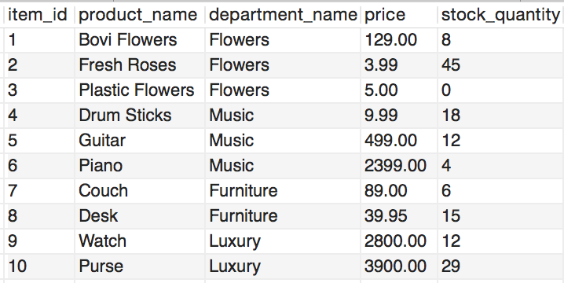

# Bamazon

## Overview

* bamazonCustomer.js will take in orders from customers and deplete stock from the store's inventory

  * Shows available products, departments and their prices. 

  * Prompts user for a new purchase and checks the stock quantity. If available, depletes the stock quantity and shows the order total.

  * [Click here for a video demo](./customer-walkthrough-compressed.mov)

  * The app updates and retrieves data from the 'bamazon' MySQL Database shown here: 

* bamazonManager.js will have the following 4 options:

  * View Products for Sale
    
  * View Low Inventory
    
  * Add to Inventory
    
  * Add New Product

  * [Click here for a video demo](./manager-walkthrough-compressed.mov)

* bamazonSupervisor.js will have the following 2 options:

  * View Product Sales by Department. This calculates total product sales by department and total profits by department without updating the database. 

  * Create New Department. The supervisor will be prompted with the overhead cost for the new department. This allows managers to create new products under the new department afterwards with bamazonManager.js. 

  * [Click here for a screenshot demo](./supervisor-screenshot.png)